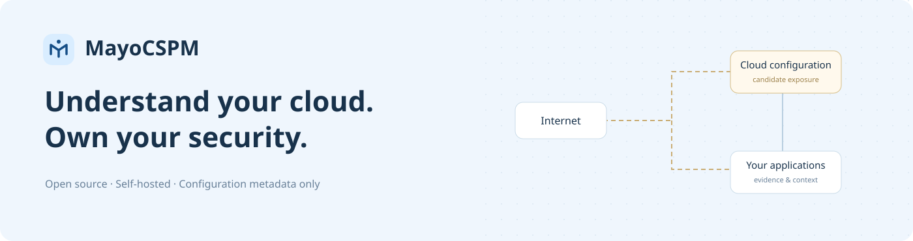
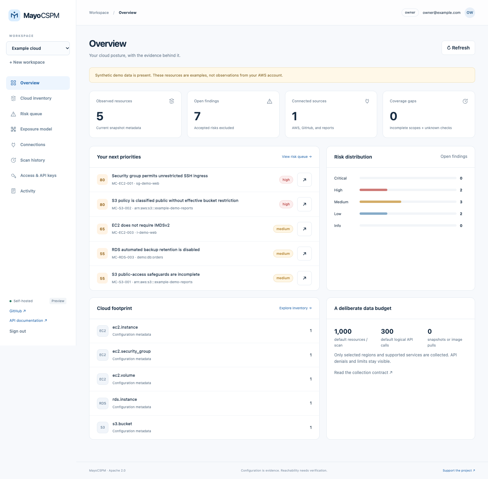
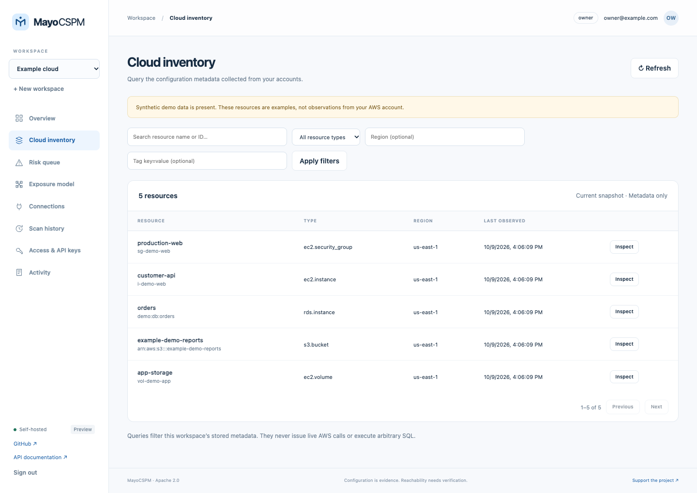
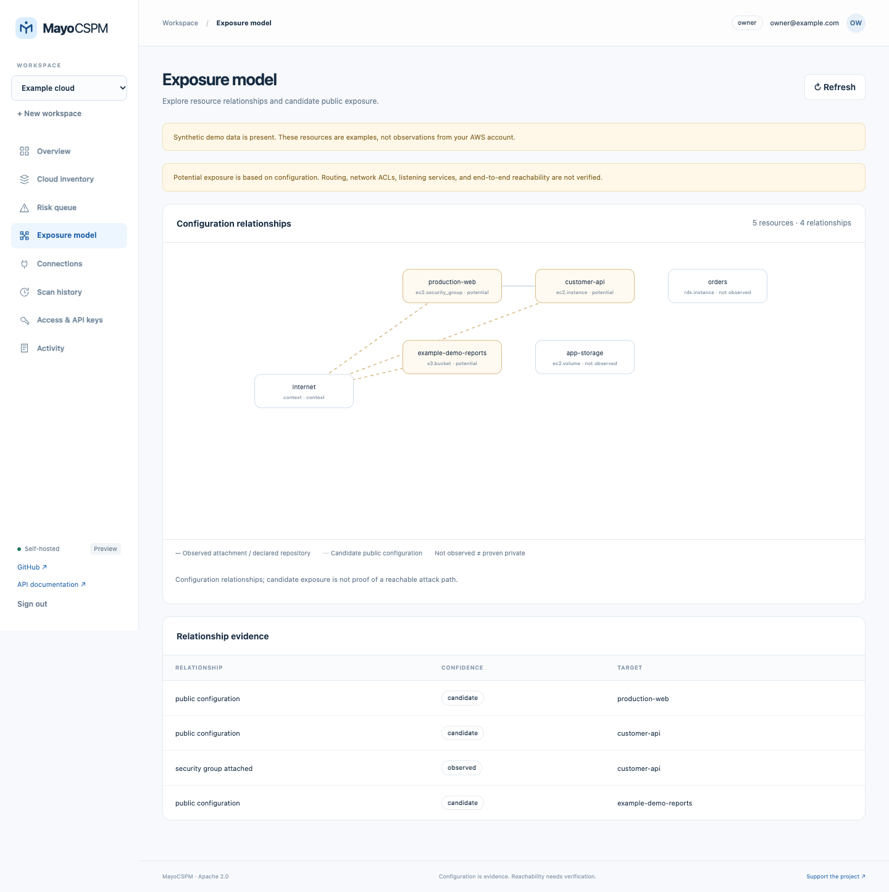

<p align="center"></p>

<p align="center"><a href="https://github.com/quentinmayo/MayoCSPM/actions/workflows/ci.yml"></a>  </p>

**MayoCSPM** is an open-source, self-hosted cloud security posture engine for
developers and small teams. Collect bounded AWS configuration metadata, query your
inventory, inspect risk evidence, and model resource relationships. Add GitHub
security alerts or SARIF reports when application context is useful.

The engine has no license fee. You supply the host and pay any infrastructure or
API costs. [Mayo CSPM](https://mayocspm.com) is the commercial project direction;
support and managed services are planned. For existing application security
services, see [Mayo ASPM](https://mayoaspm.com/).

## Quick start

Install [Docker Engine with Compose](https://docs.docker.com/engine/install/) and
Python 3 on a machine with at least **2 CPUs, 2 GiB RAM, and 10 GiB free disk**.
4 GiB RAM is more comfortable for building images. Then:

```sh
git clone https://github.com/quentinmayo/MayoCSPM.git
cd MayoCSPM
bash scripts/setup.sh
```

The installer asks for the first administrator's email, generates private
credentials in `.env` (mode 600), and starts the app, one worker, and PostgreSQL.
It preserves an existing `.env` and database on repeat runs. Read the generated
`BOOTSTRAP_PASSWORD` locally; do not paste it into an issue or terminal recording.

Open **http://localhost:8010**, sign in, create a workspace, and choose **Try demo
data** to explore without AWS credentials. Synthetic data is visibly labeled.
The interface includes inventory filters, findings, a configuration relationship
diagram, connection scopes, schedules, API keys, and workspace activity.

For a remote host, use an SSH tunnel or configure a maintained HTTPS reverse proxy
and set `PUBLIC_URL` to the exact external origin before signing in. The default
port binds only to loopback. The database has no published port.

## Screenshots

These are actual interface captures from the Docker/PostgreSQL deployment using
only the built-in synthetic workspace. No real cloud inventory or credentials
are included. [All nine captures](docs/SCREENSHOTS.md).



<details><summary>Inventory queries and exposure model</summary>





</details>

## What it does today

| Capability | Preview implementation |
| --- | --- |
| AWS inventory | EC2 instances, security groups, EBS volume metadata, S3 buckets, RDS instances, account IAM summary, CloudTrail summary, EKS clusters |
| Posture rules | 15 original, inspectable checks with evidence, guidance, and AWS references |
| Inventory queries | Resource type, region, literal name/ID search, tag key/value, bounded pagination |
| Relationship model | Observed security-group attachments, explicit repository tags, candidate public configurations |
| Optional ASPM input | GitHub code-scanning/Dependabot alert APIs; SARIF 2.1.0 import, 1,000 results / 2 MiB |
| Continuous collection | Manual scans or 1–168 hour schedules; durable jobs, worker leases, coverage reporting |
| Access | Workspaces; owner/admin/analyst/viewer; hashed and revocable 90-day API keys; audit trail |
| Data location | Local PostgreSQL by default; external PostgreSQL overlay; SQLite for development/tests |

**This is an early preview, not Wiz feature parity.** There is no workload disk
inspection, ECR image download, exploit verification, full IAM entitlement analysis,
DSPM, real-time event ingestion, certified compliance assessment, or automated
cloud remediation. OAuth/LDAP/MFA, advanced query languages, additional clouds,
and schema upgrade migrations remain on the [roadmap](docs/ROADMAP.md).

## A deliberate collection budget

Default AWS connections collect **one selected region, at most 1,000 resources and
300 logical API calls**. The hard caps are four regions, 5,000 resources, 1,000
logical calls, 8 MiB of normalized metadata, and a ten-minute collector deadline
checked between requests. API retries allow at most two HTTP attempts per logical
call. STS role onboarding/identity calls are additional, small fixed overhead.

**No cloud writes, volume snapshots, image downloads, S3 object reads, secret-value
reads, or database-content reads.** The collector's IAM template enumerates only
the supported metadata APIs. The API app receives no AWS credentials; only the
worker uses an operator role or a private profile to assume a collector role.

The app, worker, and database have combined Compose limits of **1.5 CPUs and
1,280 MiB RAM**. Only the latest collected resource metadata is stored. Resolved
findings expire after 90 days; audit events expire after 30 days; completed job
history is capped. Open/stale findings remain visible until a check passes, so
they need a separate cardinality limit. Filesystem quotas, backup retention, WAL,
Docker images, and free-space alerts remain host responsibilities.

Missing permissions, truncated collection, uncollected scopes, and absent fields
are **unknown**, not healthy results. A failed collector or disappearing resource
never silently resolves a finding. Candidate exposure does not prove that a
network path is reachable. See the [data contract](docs/DATA-BUDGET.md).

## Connect AWS and GitHub

Follow [AWS onboarding](docs/AWS.md) to create a read-only role with a unique,
server-generated external ID. Initial validation tries missing and wrong IDs and
rejects permissive trust policies. Scope collectors by region and service.

Use [GitHub and SARIF](docs/GITHUB.md) for optional repository context. GitHub alert
availability depends on repository settings, permissions and plan. MayoCSPM does
not promise free access to GitHub features that require a paid plan. Imported
reports discard matched snippets and messages; repository code is not executed.

## Documentation and verification

- [Deployment: Compose, external PostgreSQL, Unraid, AWS, Kubernetes](docs/DEPLOYMENT.md)
- [Collection, resource limits, and retention](docs/DATA-BUDGET.md)
- [AWS role setup](docs/AWS.md) · [GitHub integrations](docs/GITHUB.md)
- [Architecture and threat boundaries](docs/ARCHITECTURE.md)
- [API usage](docs/API.md) · [Security policy](SECURITY.md)
- [Validation evidence and limitations](docs/VALIDATION.md) · [Roadmap](docs/ROADMAP.md)
- [Contributing](CONTRIBUTING.md)

The API's interactive Swagger documentation is at `/docs` on your instance.

```sh
python3 -m venv .venv
.venv/bin/pip install -r requirements-dev.txt
.venv/bin/ruff check app tests scripts
.venv/bin/pytest -q
.venv/bin/pip-audit -r requirements.txt --progress-spinner off
```

Install verified Gitleaks 8.30.1+ and run `git config core.hooksPath .githooks`.
Use `scripts/safe-commit.sh "message"`: it scans all publication candidates before
staging, scans the index before committing, and runs the commit hook again. CI
also checks candidate files and Git history with redacted output. Real inventories
and operator credentials belong outside the checkout.

## Support the project

[Buy the developers a coffee](https://buymeacoffee.com/quentinmayo) ·
[Meet Quentin Mayo](https://www.quentinmayo.com/) ·
[Mayo ASPM](https://mayoaspm.com/)

Apache-2.0. The independently written project is not affiliated with Wiz or AWS.
The name avoids confusion with the separate, archived
[OpenCSPM project](https://github.com/OpenCSPM/opencspm).
