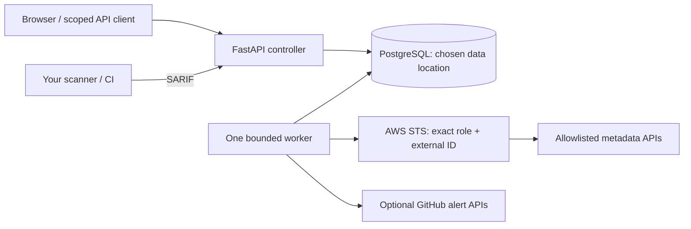

# Architecture and trust boundaries

The controller handles users, workspace ownership, inventory queries, findings,
connections, scheduling and report imports. It has no AWS credentials. Only the
worker uses an operator identity and assumes a target role. Cloud collection is
configuration-only; no workload content, scanning agents, snapshot engine or
Docker socket is needed. The core and commercial packaging have separate Git
repositories; the commercial UI builds on a pinned public engine revision.

Each resource lookup checks workspace ownership. Workspaces are the sharing
boundary; everyone in a workspace can see its inventory/findings. Owner/admin
manage members, credentials, connections and risk acceptance; analyst can scan
and import reports; viewer reads. API keys are hashed and workspace-scoped,
inherit the issuer's current membership/role, expire after 90 days, and can be
revoked. The browser uses HttpOnly, SameSite=Strict cookies; mutating requests
require the configured exact Origin. HTTPS origins issue Secure cookies.

Passwords use Argon2id. There is no public account registration or email-based
recovery in this preview. Operators bootstrap the first account locally and
workspace administrators create additional users. Login windows persist in the
database. Configure proxy-aware rate limiting separately: the app deliberately
does not trust arbitrary forwarded client-IP headers.

Jobs persist in PostgreSQL. A database partial unique index permits only one
queued/running job per connection. Workers claim through conditional writes,
heartbeat every 20 seconds and hold a two-minute lease. Expired jobs fail visibly;
results cannot commit after losing the lease. The preview supports one worker
and one app replica; horizontal scheduling and overlapping collector execution
are not a supported operating mode.

Current snapshots replace resource metadata atomically. Check identities are
stable across scans. A known pass resolves a previous failure; an unknown field,
missing resource or denied collector does not. Temporary risk acceptance requires
an administrator, a reason and a 1–90 day expiry, recorded in audit history.
All risk scores expose deterministic severity and tag/configuration adjustments.

The graph records observed attachments, declared repository tags and candidate
public configurations. It does not account for routes, NACLs, listeners, WAF,
identity permission paths or exploitability. A node labeled `not_observed` means
the supported public condition was not observed; it does not prove privacy.

## Production gates

Database authorization is enforced by the application; PostgreSQL RLS is not
currently configured. Enterprise SSO/MFA, cross-account live trust tests,
upgrade/restore-tested migrations, automated disk admission checks, advanced
network/identity modeling and independent security review remain unfinished.
Do not offer this preview as a proven multi-customer SaaS isolation boundary.
Keep real inventories private, back up PostgreSQL and the encryption key, and
use a maintained TLS reverse proxy with host/disk monitoring.
